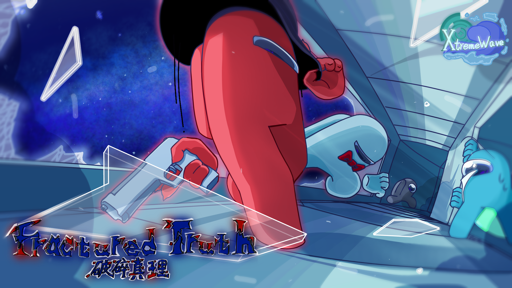

	

[English] | [简体中文](README_zh.md)

The turbulent clock strikes,

In the medieval city that lingers in forgotten demise.

Shattered truths are being stitched together;

Supernatural phenomena permeate the air.

The long night is about to descend...

Heavy fog envelops, endless blood moon.

FracturedTruth, stay tuned.

> [!note]
> This mod is not affiliated with Among Us or Innersloth LLC, and the content contained therein is not endorsed or otherwise sponsored by Innersloth LLC.\
> Portions of the materials contained herein are property of Innersloth LLC. \
> © Innersloth LLC.

> [!TIP]
> This mod is developed based on [Clash Of Gods](https://github.com/CognifyDev/ClashOfGods/).  
After the first release of [Clash Of Gods](https://github.com/CognifyDev/ClashOfGods/), Fractured Truth will undergo development during this period.

>[!IMPORTANT]
>If you wish to accelerate the development progress of Fractured Truth,  
>Please join [CoginifyDev](https://github.com/CognifyDev) or [XtremeWave](https://github.com/XtremeWave) to contribute to the development. We guarantee that this mod will offer you an unprecedented gaming experience

